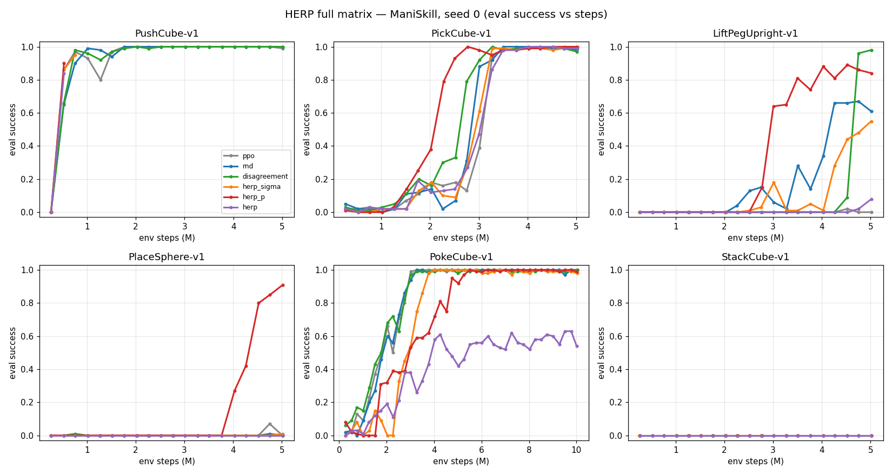

# HERP — consolidated status & results (2026-09-11)

Precautionary consolidated snapshot of all experiment workstreams. Written
mid-run as a backup. **W&B:** https://wandb.ai/hust_edu_vn/herp

| Workstream | Status | W&B group |
|---|---|---|
| ManiSkill full matrix (6 tasks × 6 methods) | ✅ **DONE** | `full-matrix-1seed` |
| Meta-World / Fetch (6 tasks × 6 methods) | 🔄 **IN PROGRESS** (~0/36 done) | `cpu-mw-fetch-1seed` |
| PegInsertionSide staged PPO | 🔄 **IN PROGRESS** (0% through 25M) | `peg-staged` |

**Hardware:** RTX 5080 (16 GB) + i5-14600KF (~9–10 usable CPU cores; `nproc`
misreports 1). ManiSkill uses GPU sim (`physx_cuda`, num_envs=1024); Meta-World/
Fetch use CPU MuJoCo (~200 steps/s/cell) with the agent on cuda.
**Fairness:** within each task, all methods share the PPO backbone, budget, and
seed (0); only the exploration/allocation mechanism differs.
**Caveat:** single seed → results are fair but *suggestive, not statistically
conclusive*. Confirm the discriminative ones with seeds 1–2.

---

## 1. ManiSkill full matrix — FINAL (seed 0)

Budget 5M (PokeCube 10M). eval success = final / best.

| Task | ppo | rnd | disagreement | herp_sigma | herp_p | herp |
|---|---|---|---|---|---|---|
| PushCube        | 0.99/1.00 | 1.00/1.00 | 1.00/1.00 | 0.95/0.95 | 0.90/0.90 | 0.84/0.84 |
| PickCube        | 0.98/0.98 | 0.98/1.00 | 0.97/1.00 | 1.00/1.00 | 1.00/1.00 | 0.99/1.00 |
| LiftPegUpright  | 0.00/0.02 | 0.61/0.67 | **0.98/0.98** | 0.55/0.55 | 0.84/0.89 | 0.08/0.08 |
| PlaceSphere     | 0.00/0.07 | 0.00/0.01 | 0.00/0.01 | 0.01/0.01 | **0.91/0.91** | 0.00/0.00 |
| PokeCube        | 1.00/1.00 | 1.00/1.00 | 1.00/1.00 | 0.98/1.00 | 0.99/1.00 | 0.54/0.63 |
| StackCube       | 0.00 | 0.00 | 0.00 | 0.00 | 0.00 | 0.00 |



**Headline:** on the hard-to-explore medium tasks, **`herp_p` is the standout** —
the only method that solves **PlaceSphere** (0.91 vs ~0), and 2nd on
**LiftPegUpright** (0.84). Easy tasks (PushCube/PickCube/PokeCube) saturate for
everyone; StackCube needs >5M (all 0). Full write-up:
[`FULL_MATRIX_REPORT_2026-09-11.md`](FULL_MATRIX_REPORT_2026-09-11.md).

---

## 2. Meta-World / Fetch — IN PROGRESS (partial, noisy)

Budget 1M/task (reduced from 2M — tasks solve well under 1M), 8 parallel workers.
Only the first tasks have eval data; numbers below are **best-so-far at differing
step counts** (NOT a final fair snapshot) and Meta-World eval success is noisy
(collapses between checkpoints). **2 cells have failed so far — to investigate.**

| Task | ppo | rnd | disagreement | herp_sigma | herp_p | herp | note |
|---|---|---|---|---|---|---|---|
| button-press-v3 | 0.52 | 0.48 | 0.88 | 1.00 | 1.00 | 1.00 | HERP variants reach 1.0; PPO/RND lag |
| drawer-open-v3  | 0.00 | 0.00 | 0.00 | 0.00 | — | — | still early / not learning yet |
| pick-place-v3   | — | — | — | — | — | — | queued |
| peg-insert-side-v3 | — | — | — | — | — | — | queued |
| FetchPush-v4    | — | — | — | — | — | — | queued |
| FetchPickAndPlace-v4 | — | — | — | — | — | — | queued |

Early signal (button-press): the three HERP variants hit 1.0 while ppo/rnd lag
(~0.5) — consistent with the ManiSkill story. **A nohup finalize script will
auto-generate the final Meta-World/Fetch report and push it** when this suite
completes (`MW_FETCH_REPORT_<date>.md`), even if no interactive session is open.

---

## 3. PegInsertionSide — staged PPO, IN PROGRESS

Staged budget escalation (`scripts/run_peg_staged.py`), PPO only, resuming each
stage from the previous checkpoint:

| Budget | 5M | 10M | 15M | 20M | 25M | 35M |
|---|---|---|---|---|---|---|
| best eval success | 0.0 | 0.0 | 0.0 | 0.0 | 0.0 | running |

**Result so far: plain PPO does not solve PegInsertionSide (★★★★★) through 25M** —
a useful negative result. Escalation continues to 35M→50M→75M (likely stays 0).

---

## 4. Fixes & known issues

- **Device-mismatch bug (FIXED, `3b118bd`):** Meta-World/Fetch adapters run on CPU
  while the agent runs on cuda; the action-clamp bounds were left on CPU →
  `action.clamp` crash. Fixed at all 4 clamp sites (bounds moved to action device).
  This is what unblocked the Meta-World/Fetch runs.
- **2 Meta-World/Fetch cells failed** in the current run — cause not yet
  diagnosed; restart-safe (re-running the suite retries cells without
  `complete.json`).
- **ManiSkill StackCube** needs a larger budget than 5M (all methods 0) — stage it
  like Peg.

## 5. Reproduction

```bash
# ManiSkill matrix (done):
python scripts/run_suite.py --benchmarks maniskill \
  --methods ppo rnd disagreement herp_sigma herp_p herp --seeds 0 \
  --exclude-tasks PegInsertionSide-v1 --workers 3 --device cuda --wandb-mode online

# Meta-World/Fetch (running; 1M via edited default):
python scripts/run_suite.py --benchmarks metaworld fetch \
  --methods ppo rnd disagreement herp_sigma herp_p herp --seeds 0 \
  --workers 8 --device cuda --wandb-mode online

# Peg staged (running):
python scripts/run_peg_staged.py --env-id PegInsertionSide-v1 --method ppo --seed 0 \
  --stages 5000000 10000000 15000000 20000000 25000000 35000000 50000000 75000000 \
  --num-envs 1024 --wandb-mode online
```

## 6. Next steps (priority)

1. **Seeds 1–2** for the discriminative tasks (LiftPegUpright, PlaceSphere,
   button-press) → turn the `herp_p` advantage into a citable result.
2. Finish Meta-World/Fetch (auto-finalizes) and fold into the comparison.
3. Investigate the 2 failed Meta-World/Fetch cells.
4. Stage StackCube (5M→…) to find its learning budget.
