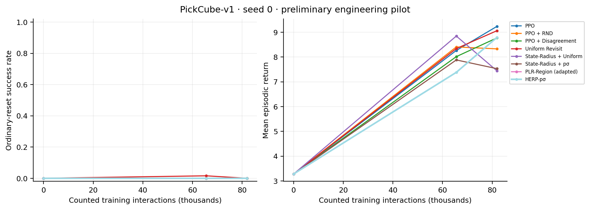

# HERP v3 — local experimental report

Generated: 2026-09-13 04:35 UTC

**Status: single-seed engineering pilot, not a publication-level benchmark.**

7/11 methods completed at generation time. The highest observed final success rate among completed runs is 0.0%; this is descriptive, not evidence of superiority.

## Experimental protocol

PickCube-v1; seed 0; 81,920 counted training interactions per planned method; 512 GPU environments; 8-step acquisition windows; the existing 3×256 PPO network and optimizer; 64 ordinary-reset evaluation episodes. All training root, region and reference transitions are counted. Evaluation and frozen-policy mechanism interactions are reported separately. The 5M-step planning budget in EXPERIMENTS.md was reduced for this time-bounded pilot. No additional training seeds were started.

Root-only data-availability warm-up requires 4 predictor labels, so a substantial fraction of this short GPU pilot can precede activation. The activation step and actual region interactions are included in results.csv. Partial evaluations must not be compared as equal-budget final results.

The shorter breadth protocol is a horizon/warm-up engineering variant, not the default M=32 method. Longer development runs are kept separate and excluded from this equal-budget table.

## Observed results

| method                 | status    |   train_steps |   evaluation_step |   success |   return_mean |   region_steps |
|:-----------------------|:----------|--------------:|------------------:|----------:|--------------:|---------------:|
| PPO                    | completed |         81920 |             81920 |    0.0000 |        9.2364 |              0 |
| PPO + RND              | completed |         81920 |             81920 |    0.0000 |        8.3282 |              0 |
| PPO + Disagreement     | completed |         81920 |             81920 |    0.0000 |        8.7719 |              0 |
| Uniform Revisit        | completed |         81920 |             81920 |    0.0000 |        9.0619 |          62680 |
| State-Radius + Uniform | completed |         81920 |             81920 |    0.0000 |        7.4419 |          62680 |
| State-Radius + pσ      | completed |         81920 |             81920 |    0.0000 |        7.5299 |          56104 |
| PLR-Region (adapted)   | partial   |         20480 |                 0 |    0.0000 |        3.2808 |           3016 |
| SACL-style (adapted)   | not run   |             0 |                 0 |  nan      |      nan      |              0 |
| HERP-σ                 | not run   |             0 |                 0 |  nan      |      nan      |              0 |
| HERP-p                 | not run   |             0 |                 0 |  nan      |      nan      |              0 |
| HERP-pσ                | completed |         81920 |             81920 |    0.0000 |        8.7911 |          57352 |



## Mechanism evidence

Independent-pool frozen-policy analysis is available for 25 successfully collected regions from the development HERP checkpoint. Collection stopped on a restore-consistency failure in a later region; the atomic saved pool is intact. These are exploratory pre-correction mechanism results. Direct and learned estimators use the same held-out regions. Resampling variability is not training-seed uncertainty.

The controlled PPO-delta relevance gate has not yet been established.

## Implementation and validation

The v3 path implements Gaussian-KL chain boundaries, entry-context clustering, fixed-M dispersion, weighted ridge regression, signed-cosine EMA relevance, root-inclusive pσ allocation, and independent-fragment GAE. The PPO optimizer is reused. `train.py` now dispatches to v3; `--legacy-v2` selects the previous runner. Code provenance for the main pilot is archived in `seed0_breadth/source.tar.gz` and per-run source archives.

ManiSkill GPU required `LD_LIBRARY_PATH=/usr/lib/wsl/lib` on this WSL host. The measured raw throughput at 512 environments was approximately 4,717 transitions/s. Snapshot restoration includes simulator state, controller state, elapsed clocks and contact-derived observation memory. This restores the observation at acquisition entry; it does not claim to serialize every internal PhysX solver cache. An early CPU non-contact replay check measured next-observation error 5.36e-7. Contact-specific replay evidence is insufficient where no qualifying contact snapshots were found.

## Limitations and interpretation

- The non-root region cap of 64 is reached early in the HERP pilot. Capped region-count curves cannot establish absence of region explosion.
- One training seed supports descriptive curves only. No across-seed confidence intervals, aggregate 18-task IQM, or probability-of-improvement claim is made.
- The pilot budget is far below the planned ManiSkill benchmark budgets. Zero success at this budget cannot establish algorithm failure; nonzero differences cannot establish superiority.
- Child-entry total variance is treated as a root proxy. Conditional root means and child-acquisition variance need not define the same root-time distribution. Missing child means use an explicitly logged common prior.
- The predictor and relevance mechanism acceptance gates are not all established. These are engineering pilots, not expensive main-paper experiments that passed every gate in IMPLEMENTATION.md.
- PLR-Region and SACL-style are adaptations. SACL-style uses fixed-state value change with uncertainty coefficient zero. They are not official published implementations.
- RFCL, Active RL, BRO and MaxInfoRL official codebases were downloaded and commit-locked, but their training results are not available. RFCL requires demonstrations; Active RL uses an offline-to-online setting. They are excluded from the same-information table.
- Two early development runs stopped on snapshot observation mismatch. Their trajectories and any partial results are excluded from the main table.

## Reproduction

```bash
source ~/miniconda3/etc/profile.d/conda.sh
conda activate deeplearning
export LD_LIBRARY_PATH=/usr/lib/wsl/lib
export VK_ICD_FILENAMES=/usr/share/vulkan/icd.d/lvp_icd.json
OMP_NUM_THREADS=1 MKL_NUM_THREADS=1 python train.py --method herp --num-envs 512 --num-eval-envs 32 --future-horizon 8 --predictor-min-labels 4 --total-timesteps 81920 --eval-episodes 64 --eval-interval 65536 --checkpoint-interval 65536 --output-dir outputs/reproduction_herp_seed0
```

Publication artifacts: learning_curves.pdf/svg, allocation_diagnostics.pdf/svg, results.csv, results_table.tex, report.pdf. Completed oracle analysis additionally produces sigma_mechanism.pdf/svg and numeric tables. Raw logs and checkpoints remain in the campaign output directory.
